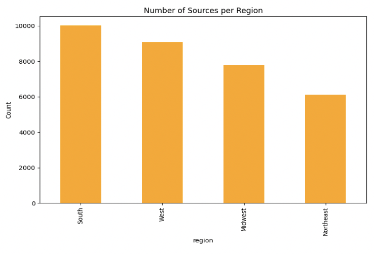
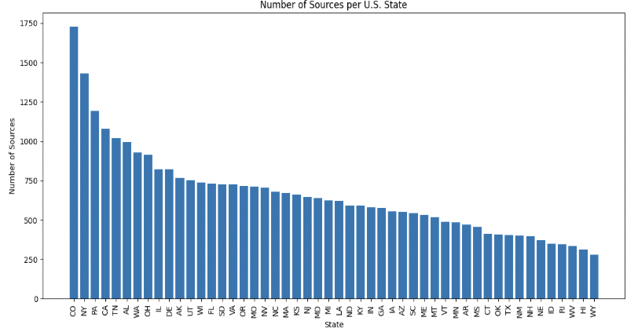
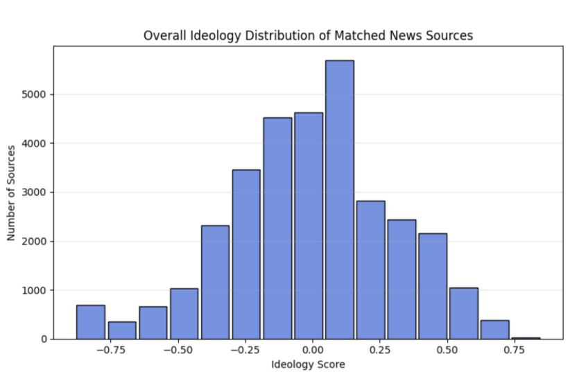

# data-curation-evaluation-scripts (LUCIC???)

This repository contains tools for the development and evaluation of the Local U.S. Crime and Ideology Corpus (LUCIC), a large-scale dataset of local news articles about crime and justice systems across the United States. LUCIC was created using a curated list of local news websites from all 50 states representing different ideological perspectives, including left-leaning, right-leaning, and centrist outlets ([CITE]; [GitHub link]).

Articles were identified within selected Common Crawl collections (CC-MAIN-2018-43, CC-MAIN-2019-09, CC-MAIN-2020-10, CC-MAIN-2023-06, and CC-MAIN-2024-14) using a purpose-built Python pipeline. Text was extracted with BeautifulSoup, and articles without reliable publication dates were excluded.

Content was filtered through a hierarchical keyword framework to capture discussions of crime and justice, with two tiers of specificity (e.g., sexual abuse, offender, defendant, witness). The final dataset includes 33,506 articles from 551 local U.S. news sources, spanning all 50 states and representing diverse ideological and geographic coverage. Scripts for data collection and evaluation are provided in this repository.

**total corpus size:** 33,506 articles

## The Current Repository

This repository contains the scripts used to build LUCIC from scratch by:

* Collecting and filtering articles from local U.S. news websites using predefined source lists and Common Crawl snapshots.
* Extracting article text and metadata while excluding pages without reliable publication dates.
* Identifying relevant content about crime and justice through a hierarchical keyword framework, and filtering articles based on keyword specificity.
* Generating metadata for each article, including matched keywords, keyword tier, source domain, publication date, and estimated ideological leaning.

The scripts are designed to be flexible and can be adapted for building other large-scale news corpora.

## How To Use
**Repository Setup**

Install Git on your computer. When finished, open a command line terminal, navigate to where you would like to place the repository, then enter git clone [https://github.com/eshasm2/data-curation-evaluation-scripts.git]. 

**Commands**

`git clone https://github.com/yourusername/data-curation-evaluation-scripts.git`

`cd data-curation-evaluation-scripts`

**Virtual Environment Setup**
* Install Anaconda by following the instructions [(https://www.anaconda.com/download)].
* Create a new conda environment with Python 3.12 and pip:
`conda create --name LUCIC python=3.12 pip`
* Answer y when prompted and activate the environment:
`conda activate LUCIC`
* Install all required Python packages:
`pip install -r requirements.txt`

Run the pipeline:
`python samplingcc.py --keywords keywords_tier1.txt keywords_tier2.txt --output output_folder`

## Adaptations
// add later
