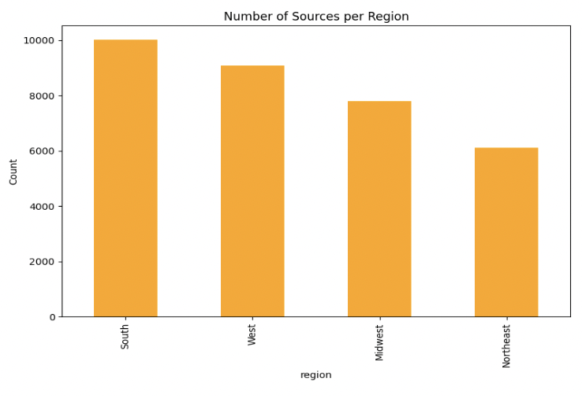
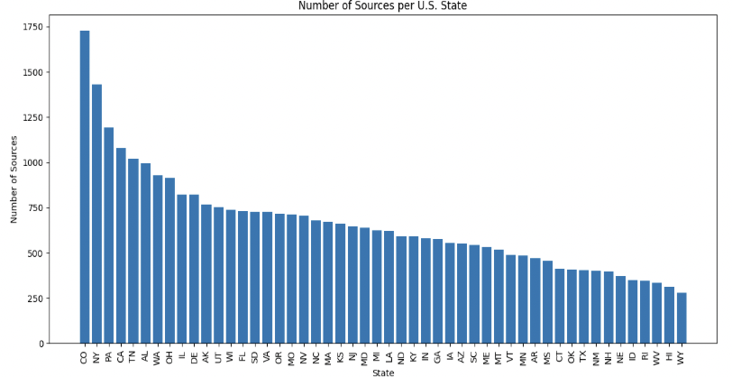
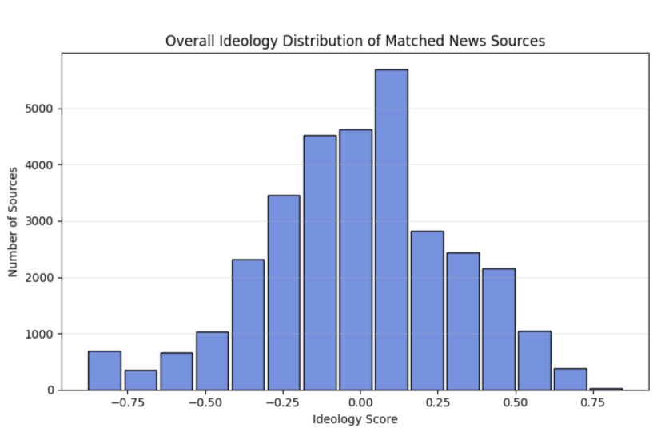

# LUCID — Local U.S. Crime and Ideology Dataset

This repository contains the pipeline used to build and evaluate **LUCID** (Local U.S. Crime and Ideology Corpus), a large-scale dataset of local news articles about crime and justice across the United States.

LUCID was built from a curated list of 551 local news sources across all 50 states, representing left-leaning, right-leaning, and centrist outlets. Articles were collected from CommonCrawl snapshots spanning 2018–2024, filtered for relevance using a two-tier keyword framework, and annotated for crime type, perpetrator/victim demographics, and ideology.

**Total corpus size:** 33,506 articles from 551 sources across all 50 states.





---

## How the pipeline works

The pipeline has four stages, run in order via `cli.py`.

### Stage 1 — `filter_keywords`
Queries CommonCrawl for pages from sources in `data/data_sources/sources.csv` whose URLs contain crime-related keywords. Downloads and extracts the full article text for each match.

- **Reads:** `data/data_sources/sources.csv`, `keywords/keywords_tier1.txt`, `keywords/keywords_tier2.txt`
- **Writes:** `data/data_filter_keywords_<years>/matched_articles.txt`

### Stage 2 — `filter_curate`
Takes the raw crawled articles and applies two stricter filters: the article body must contain at least one tier-1 keyword, and the text must include a parseable publication date. Articles that fail either check are dropped.

- **Reads:** `matched_articles.txt` from stage 1, both keyword files
- **Writes:** `data/data_filter_curate_<years>/filtered_articles.txt`, `filtered_metadata.csv`

### Stage 3 — `label_agreement`
Independently of the crawl, computes inter-rater reliability between two human coders (Eleanor and Sarah) and three LLMs (GPT, LLaMA, Qwen) on a stratified sample of articles that were manually annotated. Uses Cohen's κ for binary variables and Krippendorff's α for nominal ones.

- **Reads:** `data/data_relevance_ratings/people_info_cleaned_latest.csv`, `data/data_relevance_ratings/data_for_qualtrics.csv`
- **Writes:** `results/tables/irr_human_only.csv`, `irr_human_vs_llm.csv`, `crime_label_disagreements.csv`

### Stage 4 — `visualize`
Generates all paper figures using the curated article metadata from stage 2 and the LLM annotations from the ratings files.

- **Reads:** `filtered_metadata.csv` from stage 2, `sources.csv`, `people_info_cleaned_latest.csv`
- **Writes:** `results/figures/*.png`

---

## Setup

**1. Clone the repo**
```bash
git clone https://github.com/eshasm2/data-curation-evaluation-scripts.git
cd data-curation-evaluation-scripts
```

**2. Create a conda environment**
```bash
conda create --name LUCID python=3.12 pip
conda activate LUCID
pip install -r req.txt
```

**3. Run the pipeline**
```bash
# collect and filter articles from CommonCrawl (requires internet, takes a while)
python cli.py --resource filter_keywords --years 2018-2024
python cli.py --resource filter_curate   --years 2018-2024

# compute inter-rater reliability (can run independently, no crawl needed)
python cli.py --resource label_agreement

# generate figures (requires filter_curate to have been run first)
python cli.py --resource visualize
```

Each resource also accepts `--input` and `--output` to override default paths. Run `python cli.py --resource <name> --help` for full options.

---

## Repository structure

```
cli.py                          entry point — delegates to one of the four resource scripts
code/
  config.py                     shared constants and helpers
  filter_keywords.py            stage 1 — crawl and collect
  filter_curate.py              stage 2 — filter and clean
  label_agreement.py            stage 3 — inter-rater reliability
  visualize.py                  stage 4 — figures
data/
  data_sources/sources.csv      list of local news sources with ideology scores
  data_relevance_ratings/       human and LLM annotations for the stratified sample
keywords/
  keywords_tier1.txt            primary crime keywords (required for article inclusion)
  keywords_tier2.txt            secondary keywords (recorded as metadata only)
results/
  figures/                      output figures from visualize
  tables/                       output IRR tables from label_agreement
```
